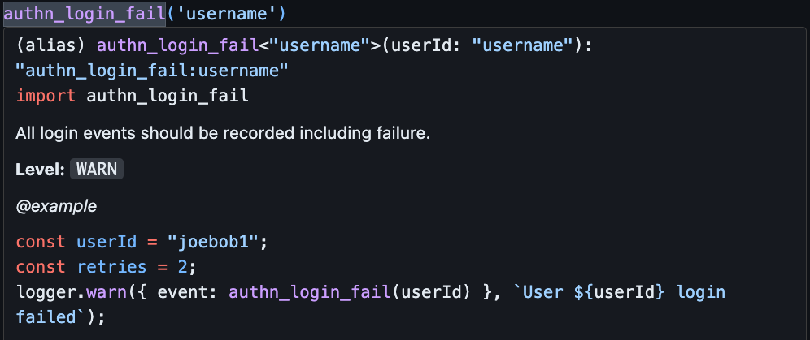

# OWASP

This package is intended to assist developers to follow OWASP best practices.

Currently, it implements the OWASP Cheat Sheet for [Application Logging Vocabulary](https://cheatsheetseries.owasp.org/cheatsheets/Logging_Vocabulary_Cheat_Sheet.html#input-validation-input), a standard vocabulary for logging security events.

The intent is to simplify monitoring and alerting such that, assuming developers trap errors and log them using this vocabulary, monitoring and alerting would be improved by simply keying on these terms.

This logging standard would seek to define specific keywords which, when applied consistently across software, would allow groups to simply monitor for these events terms across all applications and respond quickly in the event of an attack.

## Installation

```bash
npm install owasp
# yarn add owasp
# pnpm install owasp
# bun install owasp
```

## Usage

### Logging vocabulary

Here is an example of how to use this package with [pino](https://github.com/pinojs/pino)
and [Express](https://github.com/expressjs/express) to log authentication events.

> Authentication is a complex topic and this example is not intended to be used in production.
> Use this as a baseline for how to use this package to log authentication events.

**You can use any logger you want!** This package simply provides a set of standard events to log.

```ts
import { Router } from "express";
// Alternatively,
// import * as vocab from 'owasp/vocab';
import {
  authn_login_fail,
  authn_login_fail_max,
  authn_login_success,
} from "owasp/vocab";
import { logger as rootLogger } from "../logger.js";

const router = Router();

const MAX_FAILED_LOGIN_ATTEMPTS = 5;

router.route("/login").post(async (req, res, next) => {
  try {
    const { userId, password } = req.body;

    // Create a child logger to automatically include context in all logs
    // Note, `requestId` is a custom property that is added to the request
    // object by a middleware.
    const logger = rootLogger.child({ userId, requestId: req.requestId });

    if (!userId || !password || userId.length === 0 || password.length === 0) {
      logger.warn(
        {
          // owasp/vocab provides a set of standard events to log.
          // Use the `event` property to log the event.
          // The result of this function is: `authn_login_fail:${userId}`
          event: authn_login_fail(userId),
        },
        `User ${userId} login failed because username or password was not provided`
      );
      return res.status(401).send("Invalid username or password.");
    }

    const user = await getUserById(userId);

    if (!user) {
      logger.warn(
        {
          event: authn_login_fail(userId),
        },
        `User ${user} login failed because user does not exist`
      );
      return res.status(401).send("Invalid username or password.");
    }
    if (!checkPassword(user.password, password)) {
      user.failedLoginAttempts++;

      if (
        user.failedLoginAttempts >= MAX_FAILED_LOGIN_ATTEMPTS &&
        user.lastFailedLoginAttempt > Date.now() - 5 * 60 * 1000
      ) {
        logger.warn(
          {
            event: authn_login_fail_max(userId, MAX_FAILED_LOGIN_ATTEMPTS),
          },
          `User ${userId} reached the login fail limit of ${MAX_FAILED_LOGIN_ATTEMPTS}`
        );
        const lockReason = "maxretries";
        logger.warn(
          {
            event: authn_login_lock(userId, lockReason),
          },
          `User ${userId} login locked because ${lockReason} exceeded`
        );
        user.locked = true;
        await user.save();
        return res.status(429).send(
          `You have reached the login fail limit of ${MAX_FAILED_LOGIN_ATTEMPTS} attempts.\
                        Please wait 5 minutes and try again.`
        );
      }
      logger.warn(
        {
          event: authn_login_fail(userId),
        },
        `User ${user} login failed`
      );
      await user.save();
      return res.status(401).send("Invalid username or password.");
    }
    if (user.locked) {
      logger.warn(
        {
          event: authn_login_fail(userId),
        },
        `User ${userId} login failed because user is locked`
      );
      return res.status(401).send("Account is locked. Please contact support.");
    }

    if (user.failedLoginAttempts > 0) {
      logger.info(
        {
          event: authn_login_successafterfail(userId, user.failedLoginAttempts),
        },
        `User ${userId} login successfully`
      );
    } else {
      logger.info(
        {
          event: authn_login_success(userId),
        },
        `User ${userId} login successfully`
      );
    }

    user.failedLoginAttempts = 0;
    await user.save();

    res.cookie("session", createSession(user));

    const userResponse = toUserResponse(user);

    return res.status(200).send(userResponse);
  } catch (err) {
    next(err);
  }
});

export default router;
```

> [!Tip]
> The IntelliSense of `owasp/vocab` will help you to know which events are available, what level to log them at, and what properties to include.
> 

> [!IMPORTANT]  
> Logging events is not enough to secure your application. You should also monitor these events and take action when necessary.
> [We have provided some example implementations using popular logging and alerting tools](./docs/vocab-monitoring.md).

### DOM Utilities

This package also provides a set of DOM utilities to help increase security.

```ts
import { openPopup } from "owasp/dom";

function onClick() {
  // Applies the following attributes to the window:
  // * - `'noopener'`: Prevents the new window from having access to the originating window via `Window.opener`.
  // * - `'noreferrer'`: Omits the `Referer` header and sets `noopener` to true.
  // Subsequently, it resets the `opener` property of the new window to `null`.
  // This prevents the new window from being able to navigate the originating window.
  openPopup("https://example.com", "Window name", "width=200,height=200");
}
```

## Contributing

Contributions are welcome!

```bash
bun install
```

Ensure linting, formatting, and tests pass before submitting a PR.

```bash
bun run check
bun test # let's keep the test coverage at 100%!
```
